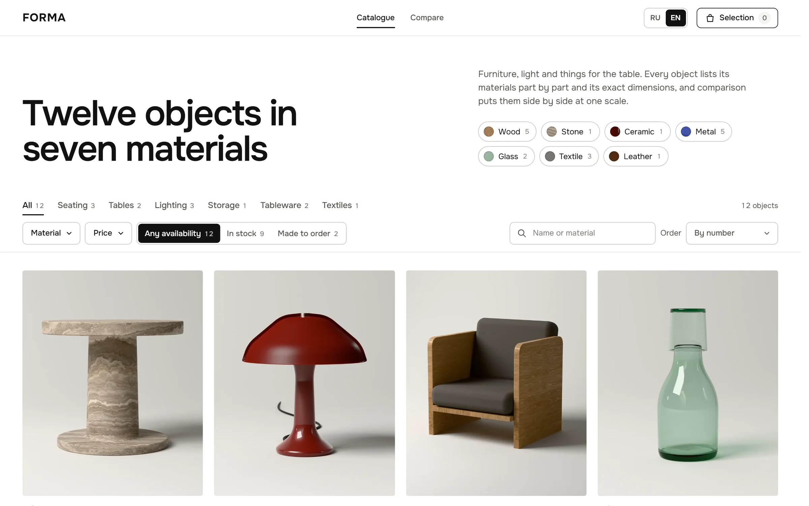

# FORMA

Bilingual catalogue of twelve home objects in seven materials, built with React and TypeScript. Product images, drawings and dimensions all come from the same parametric 3D models.



- Live version: https://velmren.com/forma/live/
- Case page: https://velmren.com/en/forma/

FORMA is fictional. Objects, prices, stock and lead times are illustrative. There is no checkout, account or payment.

## What it does

- Catalogue with category tabs, a material filter with counts, a price range, availability (in stock or made to order), search in both languages and sorting by number, price or size. Filters are stored in the URL, so a filtered view can be shared or restored with Back.
- Product page with rendered views, a front elevation with dimension lines, specifications by part, care notes, dispatch time or lead time, and other objects in the same material.
- Comparison of up to four objects: outlines at one scale on a 10 cm grid, then price, availability, dimensions, weight, materials and care. A switch hides rows where all values match.
- Selection with quantities limited by stock or by the workshop batch size. The drawer shows the total in EUR and the longest wait, and copies the list as text. Sold-out objects cannot be added.
- Russian and English. The first visit follows the browser language (any `ru*` opens Russian); an explicit choice is remembered. Selection, comparison and language are kept in local storage, and the catalogue keeps working when storage is blocked.
- The product image moves from the grid into the product page with the View Transitions API, and the grid reflows with layout animation when filters change. `prefers-reduced-motion` turns this off.

## Tech stack

React 19, TypeScript 7, Vite 8 and Motion 12. Tests use the Node.js test runner, browser checks use Playwright. The offline render bench in `render/` uses three.js 0.186 and three-gpu-pathtracer 0.0.26.

## Getting started

Prerequisites: Node.js 24 or newer and npm.

```sh
npm ci
npm run dev          # http://127.0.0.1:5173/
npm test
npm run typecheck
npm run build        # type check, then production build in dist/
npm run preview      # http://127.0.0.1:4173/
```

The build uses a relative base and hash routes, so `dist/` can be served from any subdirectory without server rewrites.

### Browser checks

The scripts in `scripts/` drive Chromium through Playwright. Install the browser once with `npx playwright install chromium`, start the dev or preview server, then run:

```sh
node scripts/check-flows.mjs http://127.0.0.1:5173/
node scripts/capture-ui.mjs http://127.0.0.1:5173/ ./shots "catalogue=#/@1440x900" "product=#/object/cupola-lamp@390x844:full"
node scripts/record-motion.mjs http://127.0.0.1:4173/ ./motion desktop --measure
```

`check-flows.mjs` runs 18 scenarios: language detection, filters and the URL, keyboard use of the price slider and the dropdown lists, the phone bottom sheets, selection limits, sold-out objects, comparison, blocked storage and horizontal overflow at 320 px. `record-motion.mjs` records the main transitions and reports frame pacing per step; `--measure` skips video capture for a clean reading.

### Product renders

`render/` is a separate path-tracing bench and is not part of the catalogue build. It needs a GPU and, for encoding, ffmpeg. The GPU flags in the scripts target Windows (ANGLE on Direct3D 11); `--software` switches capture and outlines to SwiftShader.

```sh
node render/fetch-assets.mjs                 # CC0 textures and HDRI into render/.cache
node render/capture.mjs plinth-table:hero --samples=800 --size=1600x2000 --dir=master
node render/outline.mjs plinth-table         # outlines and measured dimensions
FFMPEG=/path/to/ffmpeg node render/encode.mjs master
```

`encode.mjs` writes WebP files at 480, 960 and 1440 px into `public/media/` and strips metadata. [MEDIA.md](MEDIA.md) describes the models, scene and encoding.

## Project structure

```
src/
  App.tsx         state, persistence, routing and page composition
  catalog.ts      filtering, sorting, URL format, selection reducer and restoration
  components/     catalogue, tiles, filters, product page, drawing, comparison, selection
  data/           bilingual product data, measured dimensions, media manifest
  i18n.ts         Russian and English interface text with plural rules
  styles/         CSS split by area
public/media/     encoded renders, outlines, swatches and material surfaces
tests/            node:test tests for catalog.ts
scripts/          Playwright browser checks, screenshots and motion recording
render/           offline product render bench
docs/             README screenshot
```

[PROJECT_STRUCTURE.md](PROJECT_STRUCTURE.md) has the full file map and [UX.md](UX.md) the design notes.

## Credits

- Surface textures and the studio HDRI are CC0 1.0 from [ambientCG](https://ambientcg.com) and [Poly Haven](https://polyhaven.com) (Poly Haven authors: Jenelle van Heerden, Rob Tuytel, colormass, Rico Cilliers and Sergej Majboroda). They are downloaded by `render/fetch-assets.mjs` and not stored in the repository; only crops of the colour maps ship as swatches and material surfaces. The full list is in [MEDIA.md](MEDIA.md).
- Onest variable font, SIL Open Font License 1.1, bundled through `@fontsource-variable/onest`.

## License

MIT, see [LICENSE](LICENSE).
